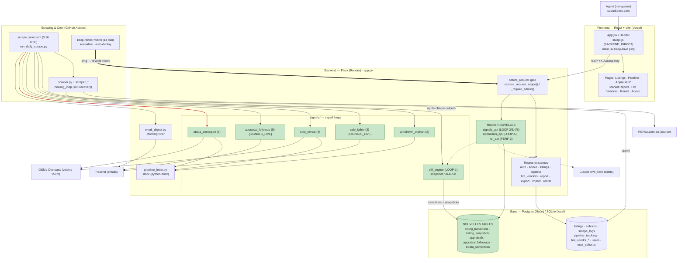

# SuburbDesk — Architecture

Vue d'ensemble du système. Le diagramme rendu (`architecture.png` / `.svg`)
est généré depuis Graphviz ; ci-dessous la version Mermaid éditable qui se
rend nativement sur GitHub.

> 🟩 = travail des signal loops (cette semaine). 🟥 = le ping keep-warm qui
> réveille Neon (cause de surconsommation compute identifiée).

## Notes
- **Auth** : toute route `/api/*` passe par le gate (`X-Access-Key`), exemptés `/api/auth/`, `/api/ping`, `/api/legal/`.
- **Signal loops** : `diff_engine` (LOOP-1) détecte les transitions entre deux scrapes via snapshot ; les autres loops consomment ces transitions.
- **`[SIGNALS_LIVE]`** : `sale_fallen` et `appraisal_followup` envoient de vrais emails — gardés en dry-run tant que `SIGNALS_LIVE` n'est pas activé.
- **Conso compute** : `/api/ping` interroge la base ; le keep-warm (14 min) + un onglet ouvert (ping 5 min) empêchent Neon de se suspendre → surconsommation CU-hrs.
